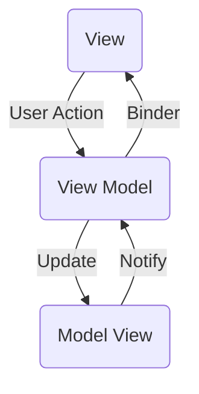

# Project Architecture

This project follows the MVVM (Model-View-ViewModel) architectural pattern, chosen for its ability to enhance code organization, maintainability, and testability. Below, you'll find an overview of the MVVM pattern, a visual representation of the architecture, and details about each component.

## 🧠 MVVM (Model-View-ViewModel) Overview

The MVVM architectural pattern is employed in this project to separate concerns and enhance maintainability. MVVM consists of three main components:
- ****Model:**** Represents the data and business logic of the application.
- ****View:**** Presents the user interface and displays data from the ViewModel.
- ****ViewModel:**** Acts as an intermediary between the Model and the View, handling data manipulation and business logic.

It's woth mentioning that these layers define a basic use case. In case of needing additional dependencies, as interactors or providers, it is always possible (and recommended) to inject those dependencies to the View Model via protocols.

## 📐 MVVM Diagram

## 💻 Implementation & Usage

To implement the MVVM architecture, we use protocols to define the interactions between components. Here are the key protocols:
- BaseModelView
- BaseView
- BaseViewModel
  
> **_NOTE:_**  you can find an example in *ArchitectureExample.swift* inside the folder *Architecture*

## 🌟 Recommendations

- Follow a modular structure to keep components decoupled and maintainable.
- Use dependency injection for better testability.
- Document each module and class with inline comments for better code comprehension.
- Consider unit testing for ViewModel logic.
